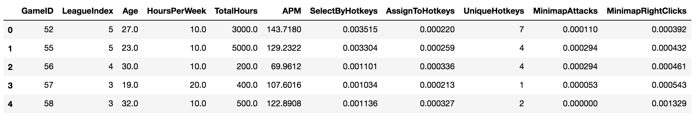
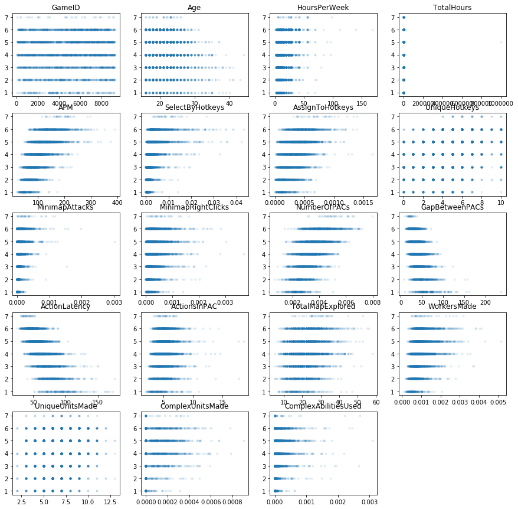
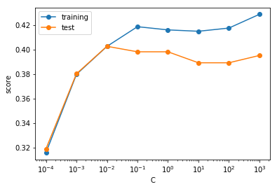
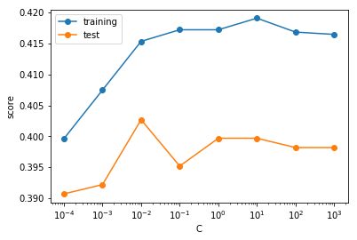

# Report

By Xin (Alex) Guo, Jan 2018

## Overview

In computer game StarCraft, there is a certain relationship between the League that a gamer can get into and his/her screen movements when playing the game. This project is trying to find the best model and features to predict the gamer's League based on his/her screen movements.

## Dataset

The dataset used in this project is the [SkillCraft1 Master Table Dataset](http://archive.ics.uci.edu/ml/datasets/SkillCraft1+Master+Table+Dataset) from [UCI Machine Learning Repository](http://archive.ics.uci.edu/ml/datasets.html). It aggregated screen movements into screen-fixations using a Salvucci & Goldberg (2000) dispersion-threshold algorithm, and defined Perception Action Cycles (PACs) as fixations with at least one action. 

## EDA

There are 3395 observations and 20 variables in the original dataset. After removing the observations with missing values, there are 3338 observations left. Variables are shown as below,

1. GameID: Unique ID number for each game (integer) 
2. LeagueIndex: Bronze, Silver, Gold, Platinum, Diamond, Master, GrandMaster, and Professional leagues coded 1-8 (Ordinal) 
3. Age: Age of each player (integer) 
4. HoursPerWeek: Reported hours spent playing per week (integer) 
5. TotalHours: Reported total hours spent playing (integer) 
6. APM: Action per minute (continuous) 
7. SelectByHotkeys: Number of unit or building selections made using hotkeys per timestamp (continuous) 
8. AssignToHotkeys: Number of units or buildings assigned to hotkeys per timestamp (continuous) 
9. UniqueHotkeys: Number of unique hotkeys used per timestamp (continuous) 
10. MinimapAttacks: Number of attack actions on minimap per timestamp (continuous) 
11. MinimapRightClicks: number of right-clicks on minimap per timestamp (continuous) 
12. NumberOfPACs: Number of PACs per timestamp (continuous) 
13. GapBetweenPACs: Mean duration in milliseconds between PACs (continuous) 
14. ActionLatency: Mean latency from the onset of a PACs to their first action in milliseconds (continuous) 
15. ActionsInPAC: Mean number of actions within each PAC (continuous) 
16. TotalMapExplored: The number of 24x24 game coordinate grids viewed by the player per timestamp (continuous) 
17. WorkersMade: Number of SCVs, drones, and probes trained per timestamp (continuous) 
18. UniqueUnitsMade: Unique unites made per timestamp (continuous) 
19. ComplexUnitsMade: Number of ghosts, infestors, and high templars trained per timestamp (continuous) 
20. ComplexAbilitiesUsed: Abilities requiring specific targeting instructions used per timestamp (continuous)

where `LeagueIndex` is the label and other variables are features.

### Scatter plot for y vs. all features

From the scatter plot, we can see that all features seems relevant (have some patterns), except for `GameID`, which is uniformly distributed. It makes sense. `GameID` is the ID number for each game. It should not be a predictor. So `GameID` was removed from the features. The number of features reduced to 18.

## Feature and model selection

Since the label is categorical (1-8), I tried Logistic Regression with L1 and L2 regularization, and tune the parameter `C` (the reciprocal of the regularization parameter) for the best result.

### For L1 regularization

- Best C: 0.01
- Training score: 0.40
- Test score: 0.40

### For L2 regularization

- Best C: 0.01
- Training score: 0.42
- Test score: 0.40

From the plots and results above, we can see that the performance of the two models are similar. Let's check how many features they used in the models with the best `C`.

Since the label is categorical, logistic function will fit a regression model to each level.

- For L1 regularization:
	- Average number of selected features in each level: 5.86
- For L2 regularization:
	- Average number of selected features in each level: 17.71

From the result above, we can see that the average number of selected features using in each level from the model with L1 regularization (5.86) is much less than the one with L2 regularization (17.71), which means the fomer model is much simpler.

## Conclusion

| | Logistic Regression with L1 regularization | Logistic Regression with L2 regularization |
|---|:---:|:---:|
| Best `C` | 0.01 | 0.01 |
| Training score with best `C` | 0.40 | 0.42 |
| Test score with best `C` | 0.40 | 0.40 |
| Average number of selected features in each level | 5.86 | 17.71 |

From the table above, we can see that the performance of the two models are similar. Therefore, we will choose the simpler model, which is Logistic Regression with L1 regularization when `C` = 0.01.